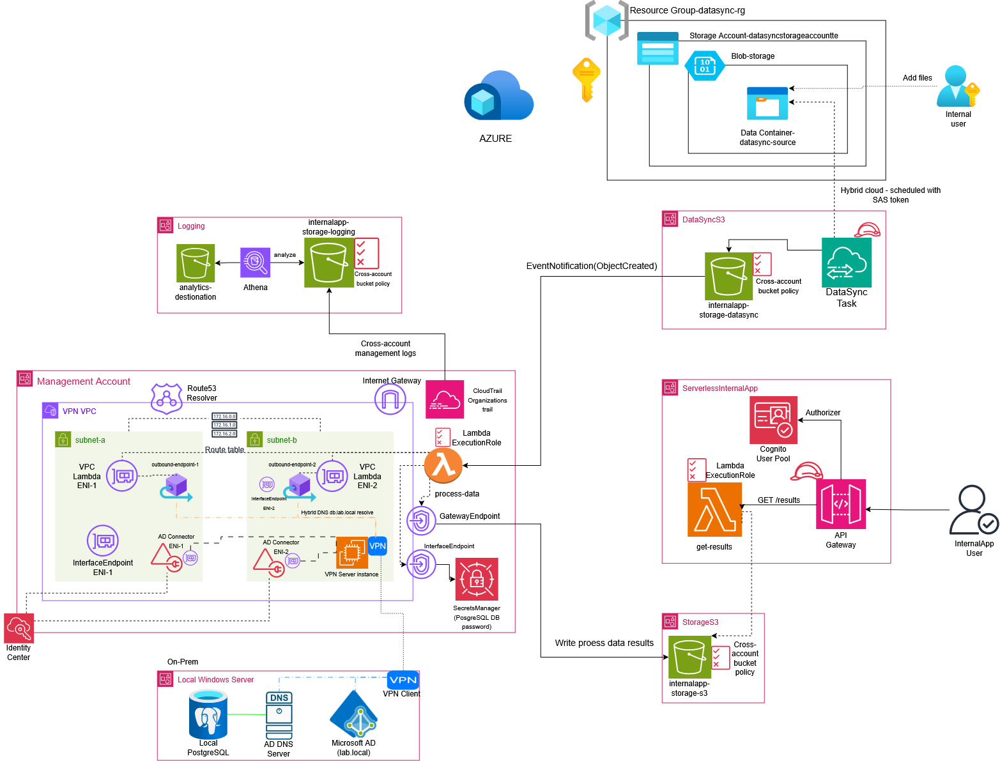
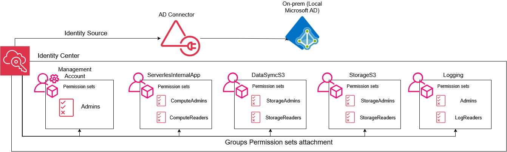
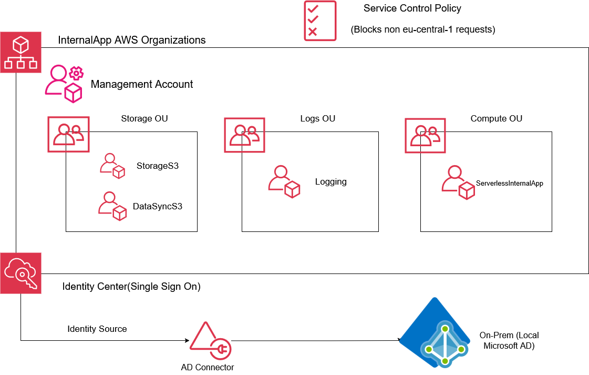

# InternalApp — Hybrid Multi-Account AWS Platform with Azure Integration

A serverless internal application built on a governed, multi-account AWS landing zone, federated with an on-prem Active Directory, and integrated with Azure Blob Storage for hybrid data ingestion. Infrastructure is managed with Terraform; the parts AWS doesn't expose through an API (Identity Center activation, identity source switching) are documented as deliberate manual steps.

## What it does

An external partner drops order files into **Azure Blob Storage**. AWS DataSync syncs them into S3, which triggers a Lambda that validates each order against live inventory in an **on-prem PostgreSQL database** (reached over a Site-to-Site VPN), decrements stock, and writes a processed report to another S3 bucket. A second Lambda, sitting behind API Gateway and authenticated via Cognito, serves those results on demand.

## Architecture



**Flow:**
1. A partner/internal user uploads an order file to an Azure Blob container.
2. AWS DataSync (agentless, cross-cloud) syncs the file into the `DataSyncS3` account on a schedule.
3. An S3 `ObjectCreated` event triggers the `process-data` Lambda (deployed inside the VPN VPC).
4. The Lambda fetches the DB password from Secrets Manager (via a VPC Interface Endpoint — no NAT needed), resolves `db.lab.local` through the on-prem AD DNS server (via a Route 53 Resolver outbound endpoint), and connects to PostgreSQL over the VPN tunnel.
5. For each order, it checks stock, updates `products.stock_quantity`, and writes a JSON report to the `StorageS3` bucket via a cross-account bucket policy.
6. A user calls `GET /results` on API Gateway (JWT-authorized via Cognito); the `get-results` Lambda reads the latest report(s) from S3 and returns them.
7. All API calls across the organization are recorded by an organization-wide CloudTrail trail, centralized in a dedicated `Logging` account and queryable through Athena.

## Identity & access



IAM Identity Center is federated with the on-prem Active Directory through an **AD Connector** rather than using a local Identity Center directory — users and groups are managed once, in AD, and synced. Access to each AWS account is granted through narrowly scoped permission sets assigned to AD groups (e.g. `StorageAdmins` / `StorageReaders`, `ComputeAdmins` / `ComputeReaders`, `LogReaders`), following least-privilege rather than account-wide admin access.

## Account structure & governance



Accounts are grouped into OUs by function (Storage, Logs, Compute) under AWS Organizations, management account excluded. A Service Control Policy denies any API call outside `eu-central-1` at the root level, with explicit exemptions for global services (IAM, Organizations, STS, Route 53, etc.) so the guardrail doesn't lock out account administration.

## Infrastructure as Code

Everything that is repeatable and reconstructible lives in Terraform, split into one state per account/concern:

```
terraform/
├── vpn-server/        VPC, subnets, route tables, Site-to-Site VPN/OpenVPN EC2, security groups
├── ad-connector/       AWS Directory Service AD Connector
├── identity-center/     Permission sets, account assignments (SSO Admin)
├── storage/             S3 buckets, cross-account bucket policies, org CloudTrail + central log bucket
├── compute/              Lambda functions, API Gateway (HTTP API), Cognito, Secrets Manager, Route 53 Resolver, VPC endpoints
└── blob-storage/         Azure Storage Account + container (azurerm provider)
```

Each account is accessed through its own named AWS CLI SSO profile; cross-account resource references use either `data` sources with tag-based lookups (CIDRs/IDs that get recreated are never hardcoded) or explicitly shared ARNs between states.

### What's deliberately *not* in Terraform

A few steps have no Terraform (or no reliable one) and are done once, by hand, and documented here rather than scripted around:

| Step | Why manual |
|---|---|
| Enabling IAM Identity Center | No Terraform resource exists for initial activation |
| Switching Identity Source to Active Directory | AWS SSO Admin API doesn't expose this; console-only |
| Syncing specific AD groups into Identity Center (Manage sync) | Same as above |
| Generating the Azure SAS token for DataSync | Short-lived, regenerated on demand |
| Accepting the AWS Organization's "All features" upgrade | One-time, irreversible-by-default org setting |

## Problems solved along the way

- **Lambda in a private subnet couldn't reach Secrets Manager or S3** — no NAT Gateway in the VPC meant both calls hung until timeout. Fixed with a VPC **Interface Endpoint** for Secrets Manager and a **Gateway Endpoint** for S3 (free, route-table based).
- **Hybrid DNS resolution** — Lambda needed to resolve `db.lab.local`, an on-prem AD-managed zone, from inside a VPC. Solved with a Route 53 Resolver **outbound endpoint** forwarding `lab.local` queries to the on-prem DNS server over the VPN tunnel.
- **Cross-region Lambda layer (`psycopg2`)** — a layer ARN from `us-east-1` silently failed when referenced from a function in `eu-central-1`; layers must be published/available in the same region as the function.
- **Cross-account S3 access for Lambda** — required bucket policies on the S3 side *and* IAM policies on the Lambda execution role side; either alone returns `AccessDenied`.
- **IAM propagation delay** — a freshly created execution role occasionally fails `sts:AssumeRole` on the very next resource in the same `apply`; resolved by re-running rather than assuming the trust policy was wrong.

## Tech stack

**AWS:** Organizations, IAM Identity Center, Directory Service (AD Connector), VPC (peering-free hybrid design), Route 53 Resolver, Lambda, API Gateway (HTTP API), Cognito, S3, DataSync, Secrets Manager, CloudTrail, Athena, Service Control Policies
**Azure:** Storage Account, Blob Containers
**On-prem:** Windows Server AD/DNS, PostgreSQL, OpenVPN
**IaC:** Terraform (`hashicorp/aws`, `hashicorp/azurerm`)
**Runtime:** Python 3.11/3.12 (Lambda)

## Diagrams

All architecture diagrams were built in draw.io and are included under [`diagrams/`](diagrams/).
